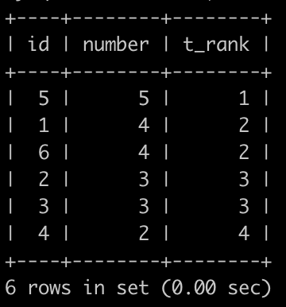

# [SQL63：刷题通过的题目排名](https://www.nowcoder.com/practice/cd2e10a588dc4c1db0407d0bf63394f3?tpId=82&&tqId=35080&rp=1&ru=/ta/sql&qru=/ta/sql/question-ranking)


## 1、题目

在牛客刷题有一个通过题目个数的(passing_number)表，id是主键，简化如下:


第1行表示id为1的用户通过了4个题目;

.....

第6行表示id为6的用户通过了4个题目;


请你根据上表，输出通过的题目的排名，通过题目个数相同的，排名相同，此时按照id升序排列，数据如下:



id为5的用户通过了5个排名第1，

id为1和id为6的都通过了2个，并列第2

## 2、题解


```sql
select id,number,
dense_rank() over(order by number desc) dr
from passing_number
order by dr,id;
```

## 3、涉及内容

(1)over 中的 ORDER BY 子句 和外层 ORDER BY  的关系

over 中的 ORDER BY 子句指示如何对每个分区中的行进行排序(根据 ORDER BY 子句相等的分区行被认为是同级的)。如果省略 ORDER BY ，则分区行是无序的，不暗含处理排序，并且所有分区行都是同级的。

窗口定义中的 ORDER BY 应用于各个分区。要对结果集进行整体排序，请在查询的顶层包含一个 ORDER BY 。
