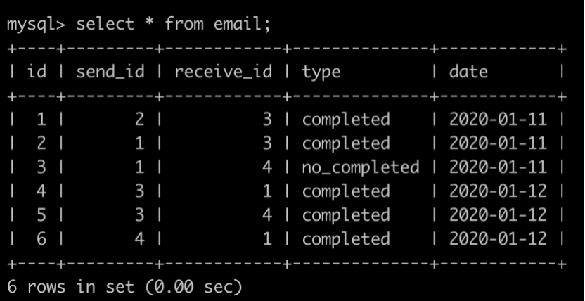
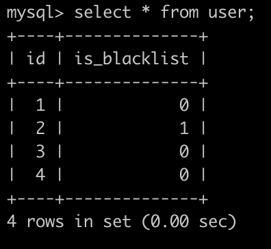
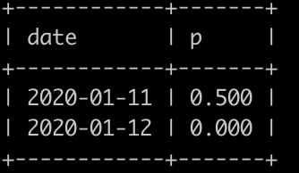

# [SQL65：异常的邮件概率](https://www.nowcoder.com/practice/d6dd656483b545159d3aa89b4c26004e?tpId=82&&tqId=35083&rp=1&ru=/ta/sql&qru=/ta/sql/question-ranking)


## 【1】、题目

统计正常用户发送给正常用户邮件失败的概率:

有一个邮件(email)表，id为主键， type是枚举类型，枚举成员为(completed，no_completed)，completed代表邮件发送是成功的，no_completed代表邮件是发送失败的。简况如下:



第1行表示为id为2的用户在2020-01-11成功发送了一封邮件给了id为3的用户;
...
第3行表示为id为1的用户在2020-01-11没有成功发送一封邮件给了id为4的用户;
...
第6行表示为id为4的用户在2020-01-12成功发送了一封邮件给了id为1的用户;


下面是一个用户(user)表，id为主键，is_blacklist为0代表为正常用户，is_blacklist为1代表为黑名单用户，简况如下:




第1行表示id为1的是正常用户;

第2行表示id为2的不是正常用户，是黑名单用户，如果发送大量邮件或者出现各种情况就会容易发送邮件失败的用户

。。。

第4行表示id为4的是正常用户

现在让你写一个sql查询，每一个日期里面，正常用户发送给正常用户邮件失败的概率是多少，结果保留到小数点后面3位(3位之后的四舍五入)，并且按照日期升序排序，上面例子查询结果如下:




结果表示:

2020-01-11失败的概率为0.500，因为email的第1条数据，发送的用户id为2是黑名单用户，所以不计入统计，正常用户发正常用户总共2次，但是失败了1次，所以概率是0.500;
2020-01-12没有失败的情况，所以概率为0.000.

(注意: sqlite 1/2得到的不是0.5，得到的是0，只有`1*1.0/2`才会得到0.5，sqlite四舍五入的函数为round)

## 2、题解


```sql
select date,
cast(sum(case when type='no_completed' then 1 else 0 end)*1.0/count(type) as decimal(10,3)) p
from email
where send_id in (select id from user where is_blacklist=0)
and receive_id in (select id from user where is_blacklist=0)
group by date
order by date;

-- join
select email.date, round(
    sum(case email.type when'completed' then 0 else 1 end)*1.0/count(email.type),3
) as p
from email
join user as u1 on (email.send_id=u1.id and u1.is_blacklist=0)
join user as u2 on (email.receive_id=u2.id and u2.is_blacklist=0)
group by email.date 
order by email.date;
```

## 3、涉及内容

(1)DECIMAL数据类型

DECIMAL数据类型用于在数据库中存储精确的数值。

	column_name  DECIMAL(P,D);

	P是表示有效数字数的精度。 P范围为1〜65，默认10。

	D是表示小数点后的位数。 D的范围是0~30。MySQL要求D小于或等于P，默认0。

	存储数值时，小数位不足会自动补0，首位数字为0自动忽略。

	小数位超出会截断，产生告警，并按四舍五入处理。

```sql
mysql> create table tmp (col1 decimal,col2 decimal(5,2));
Query OK, 0 rows affected (0.04 sec)

mysql> insert into tmp (col1,col2) values (100,100);
Query OK, 1 row affected (0.05 sec)

mysql> insert into tmp (col2) values (1.41);
Query OK, 1 row affected (0.01 sec)

mysql> insert into tmp (col2) values (12.5);
Query OK, 1 row affected (0.01 sec)

mysql> select * from tmp;
+------+--------+
| col1 | col2   |
+------+--------+
|  100 | 100.00 |
| NULL |   1.41 |
| NULL |  12.50 |
+------+--------+
```

(2) cast 和 convert

	cast(value as type) 
	
	convert(value,type)
