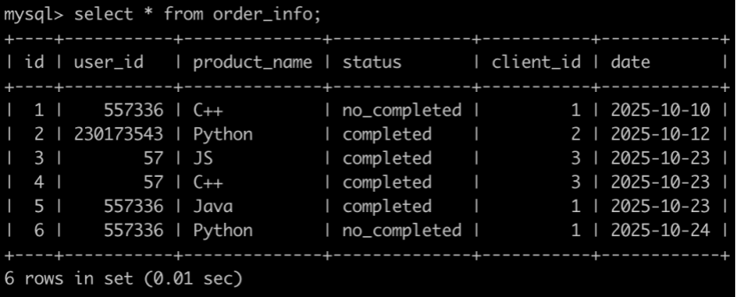
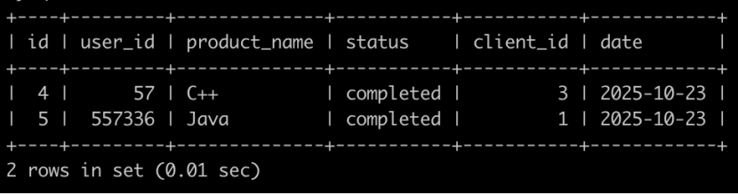

# [SQL77：牛客的课程订单分析(一)](https://www.nowcoder.com/practice/d3aa5df807f046bea5003dbc04965d67?tpId=82&&tqId=37915&rp=1&ru=/ta/sql&qru=/ta/sql/question-ranking)

## 1、题目

有很多同学在牛客购买课程来学习，购买会产生订单存到数据库里。

有一个订单信息表(order_info)，简况如下:



第1行表示user_id为557336的用户在2025-10-10的时候使用了client_id为1的客户端下了C++课程的订单，但是状态为没有购买成功。

第2行表示user_id为230173543的用户在2025-10-12的时候使用了client_id为2的客户端下了Python课程的订单，状态为购买成功。

。。。

最后1行表示user_id为557336的用户在2025-10-24的时候使用了client_id为1的客户端下了Python课程的订单，状态为没有购买成功。

请你写出一个sql语句查询在2025-10-15以后状态为购买成功的C++课程或者Java课程或者Python的订单，并且按照order_info的id升序排序，以上例子查询结果如下:



## 2、题解

```sql
SELECT `id`, `user_id`, `product_name`, `status`, `client_id`, `date`
from order_info
where date>'2025-10-15'
-- datediff(`date`,'2025-10-15')>0
and status='completed'
and (product_name='C++' or product_name='Python' or product_name='Java')
-- and product_name in ('C++','Python','Java')
order by id;
```


## 3、涉及内容

DATEDIFF() 函数返回两个日期之间的天数。

	DATEDIFF(date1,date2)

date1 和 date2 参数是合法的日期或日期/时间表达式。

注释：只有值的日期部分参与计算。