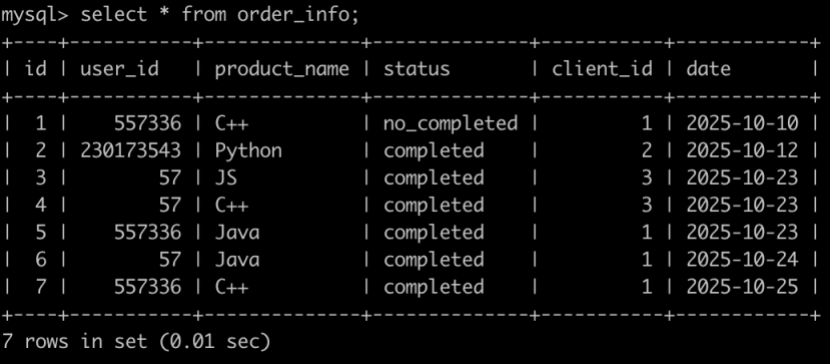

# [SQL79：牛客的课程订单分析(三)](https://www.nowcoder.com/practice/4ae8cff2505f4d7cb68fb0ec7cf80c57?tpId=82&&tqId=37917&rp=1&ru=/ta/sql&qru=/ta/sql/question-ranking)

## 1、题目

有很多同学在牛客购买课程来学习，购买会产生订单存到数据库里。

有一个订单信息表(order_info)，简况如下:



第1行表示user_id为557336的用户在2025-10-10的时候使用了client_id为1的客户端下了C++课程的订单，但是状态为没有购买成功。

第2行表示user_id为230173543的用户在2025-10-12的时候使用了client_id为2的客户端下了Python课程的订单，状态为购买成功。

。。。

最后1行表示user_id为557336的用户在2025-10-25的时候使用了client_id为1的客户端下了C++课程的订单，状态为购买成功。

请你写出一个sql语句查询在2025-10-15以后，同一个用户下单2个以及2个以上状态为购买成功的C++课程或Java课程或Python课程的订单信息，并且按照order_info的id升序排序，以上例子查询结果如下:


解析:

id为4，6的订单满足以上条件，输出它们的对应的信息;

id为5，7的订单满足以上条件，输出它们的对应的信息;

按照id升序排序

## 2、题解

```sql
select *
from order_info
where user_id in (
    select user_id
    from order_info
    where datediff(`date`,'2025-10-15')>0
        and status='completed'
        and product_name in ('C++','Python','Java')
    group by user_id
    having count(*) >= 2
) and status='completed' and datediff(`date`,'2025-10-15')>0 and product_name in ('C++','Python','Java')
order by id;
```

## 3、涉及内容