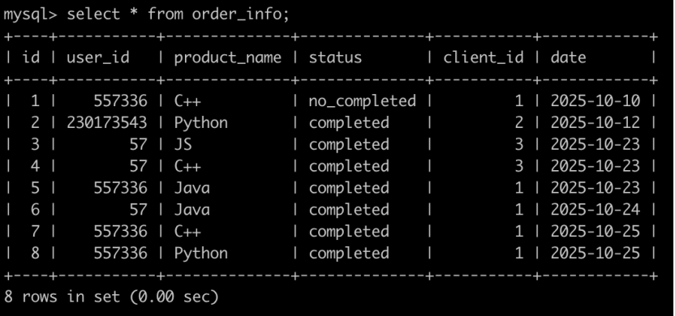
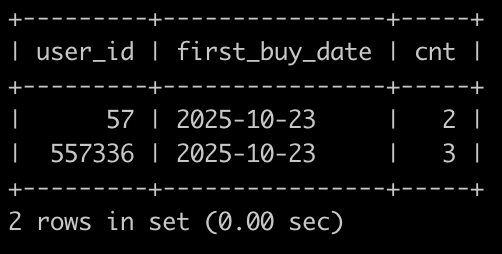

# [SQL80：牛客的课程订单分析(四)](https://www.nowcoder.com/practice/c93d2079282f4943a3771ca6fd081c23?tpId=82&&tqId=37918&rp=1&ru=/ta/sql&qru=/ta/sql/question-ranking)

## 1、题目

有很多同学在牛客购买课程来学习，购买会产生订单存到数据库里。

有一个订单信息表(order_info)，简况如下:



第1行表示user_id为557336的用户在2025-10-10的时候使用了client_id为1的客户端下了C++课程的订单，但是状态为没有购买成功。

第2行表示user_id为230173543的用户在2025-10-12的时候使用了client_id为2的客户端下了Python课程的订单，状态为购买成功。

。。。

最后1行表示user_id为557336的用户在2025-10-25的时候使用了client_id为1的客户端下了Python课程的订单，状态为购买成功。

请你写出一个sql语句查询在2025-10-15以后，如果有一个用户下单2个以及2个以上状态为购买成功的C++课程或Java课程或Python课程，那么输出这个用户的user_id，以及满足前面条件的第一次购买成功的C++课程或Java课程或Python课程的日期first_buy_date，以及购买成功的C++课程或Java课程或Python课程的次数cnt，并且输出结果按照user_id升序排序，以上例子查询结果如下:



解析:

id为4，6的订单满足以上条件，输出57，id为4的订单为第一次购买成功，输出first_buy_date为2025-10-23，总共成功购买了2次;

id为5，7，8的订单满足以上条件，输出557336，id为5的订单为第一次购买成功，输出first_buy_date为2025-10-23，总共成功购买了3次;

## 2、题解

```sql
select user_id,
    min(date) first_buy_date,
    count(*) cnt
from  order_info
where datediff(`date`,'2025-10-15')>0
    and status='completed'
    and product_name in ('C++','Python','Java')
group by user_id
having cnt >= 2
order by user_id;
```

## 3、涉及内容