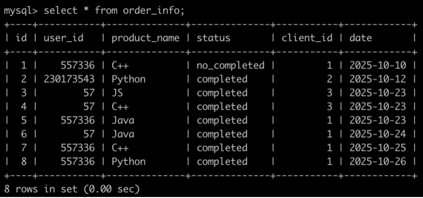
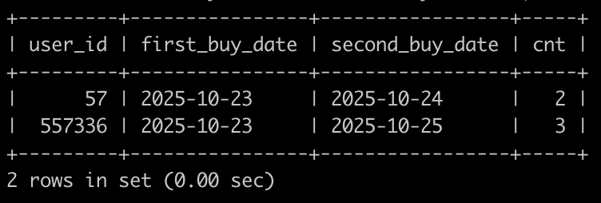

# [SQL81：牛客的课程订单分析(五)](https://www.nowcoder.com/practice/348afda488554ceb922efd2f3effc427?tpId=82&&tqId=37919&rp=1&ru=/ta/sql&qru=/ta/sql/question-ranking)

## 【1】、题目

有很多同学在牛客购买课程来学习，购买会产生订单存到数据库里。

有一个订单信息表(order_info)，简况如下:



第1行表示user_id为557336的用户在2025-10-10的时候使用了client_id为1的客户端下了C++课程的订单，但是状态为没有购买成功。

第2行表示user_id为230173543的用户在2025-10-12的时候使用了client_id为2的客户端下了Python课程的订单，状态为购买成功。

。。。

最后1行表示user_id为557336的用户在2025-10-26的时候使用了client_id为1的客户端下了Python课程的订单，状态为购买成功。


请你写出一个sql语句查询在2025-10-15以后，如果有一个用户下单2个以及2个以上状态为购买成功的C++课程或Java课程或Python课程，那么输出这个用户的user_id，以及满足前面条件的第一次购买成功的C++课程或Java课程或Python课程的日期first_buy_date，以及满足前面条件的第二次购买成功的C++课程或Java课程或Python课程的日期second_buy_date，以及购买成功的C++课程或Java课程或Python课程的次数cnt，并且输出结果按照user_id升序排序，以上例子查询结果如下:



解析:

id为4，6的订单满足以上条件，输出57，id为4的订单为第一次购买成功，输出first_buy_date为2025-10-23，id为6的订单为第二次购买，输出second_buy_date为2025-10-24，总共成功购买了2次;

id为5，7，8的订单满足以上条件，输出557336，id为5的订单为第一次购买成功，输出first_buy_date为2025-10-23，id为7的订单为第二次购买，输出second_buy_date为2025-10-25，总共成功购买了3次;

## 2、题解

```sql
-- 子查询 
select user_id,
    min(date) first_buy_date,
    (select date 
      from order_info o2
      where datediff(date,'2025-10-15')>0
          and product_name in ('C++','Java','Python')
          and status = 'completed'
          and o2.user_id=o1.user_id
      order by date
      limit 1,1
    ) second_buy_date,
    count(*) cnt
from order_info o1
where datediff(date,'2025-10-15')>0
    and product_name in ('C++','Java','Python')
    and status = 'completed'
group by user_id
having cnt>=2
order by user_id;
-- --------------------------------------

WITH order_new AS(
    SELECT *
    FROM order_info o
    WHERE date > '2025-10-15'
    AND product_name IN ('C++', 'Java', 'Python')
    AND status = 'completed'
)

SELECT 
    user_id, 
    MIN(date) AS first_buy_date,
    (SELECT date 
     FROM order_new
     WHERE user_id = o.user_id
     ORDER BY date
     LIMIT 1, 1) AS second_buy_date,
    COUNT(id) AS cnt
FROM order_new o
GROUP BY user_id
HAVING COUNT(id) >= 2
ORDER BY user_id;
-- --------------------------------------
-- 窗口函数
select user_id,
    min(date) first_buy_date,
    min(next_date) second_buy_date,
    max(cnt) cnt
from (
    select *,
      row_number() over(partition by user_id order by date) cnt,
--    count(*) over(partition by user_id) cnt,
      lead(date,1) over(partition by user_id order by date) next_date
    from order_info
    where datediff(date,'2025-10-15')>0
    and status = 'completed'
    and product_name in ('Python','Java','C++')
    order by user_id
) t
group by user_id
having cnt>=2
order by user_id;
```

## 3、涉及内容

统计个数：

- GROUP BY + COUNT   
- 窗口函数
