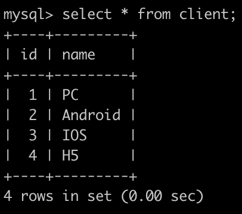

# [SQL82：牛客的课程订单分析(六)](https://www.nowcoder.com/practice/c5736983c322483e9f269dd23bdf2f6f?tpId=82&rp=1&ru=%2Fta%2Fsql&qru=%2Fta%2Fsql%2Fquestion-ranking)

## 1、题目

有很多同学在牛客购买课程来学习，购买会产生订单存到数据库里。

有一个订单信息表(order_info)，简况如下:


第1行表示user_id为557336的用户在2025-10-10的时候使用了client_id为1的客户端下了C++课程的非拼团(is_group_buy为No)订单，但是状态为没有购买成功。

第2行表示user_id为230173543的用户在2025-10-12的时候使用了client_id为2的客户端下了Python课程的非拼团(is_group_buy为No)订单，状态为购买成功。

。。。

最后1行表示user_id为557336的用户在2025-10-25的时候使用了下了C++课程的拼团(is_group_buy为Yes)订单，拼团不统计客户端，所以client_id所以为0，状态为购买成功。

 
有一个客户端表(client)，简况如下:



请你写出一个sql语句查询在2025-10-15以后，同一个用户下单2个以及2个以上状态为购买成功的C++课程或Java课程或Python课程的订单id，是否拼团以及客户端名字信息，最后一列如果是非拼团订单，则显示对应客户端名字，如果是拼团订单，则显示NULL，并且按照order_info的id升序排序，以上例子查询结果如下:


解析:

id为4，6的订单满足以上条件，且因为4是通过IOS下单的非拼团订单，输出对应的信息，6是通过PC下单的非拼团订单，输出对应的信息以及客户端名字;

id为5，7的订单满足以上条件，且因为5与7都是拼团订单，输出对应的信息以及NULL;

按照id升序排序

## 2、题解

```sql
-- 子查询 
select o.id,o.is_group_buy,c.name client_name
from (
    select *
    from order_info
    where datediff(date,'2025-10-15')>0
        and product_name in ('C++','Java','Python')
        and status = 'completed'
    ) o left join client c on o.client_id=c.id
where o.user_id in (
    select user_id
    from order_info
    where datediff(date,'2025-10-15')>0
        and product_name in ('C++','Java','Python')
        and status = 'completed'
    group by user_id
    having count(*) >=2)
order by o.id;
-- --------------------------------------
-- 窗口函数
select o.id,o.is_group_buy,c.name client_name
from (
    select *,
        count(id) over(partition by user_id) cnt
        -- 如果使用 row_number ，会过滤到部分符合条件的数据
    from order_info
    where datediff(date,'2025-10-15')>0
        and product_name in ('C++','Java','Python')
        and status = 'completed'
    ) o left join client c on o.client_id=c.id
where o.cnt>=2
order by o.id;

```

## 3、涉及内容


