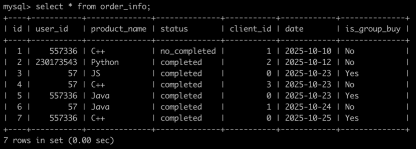
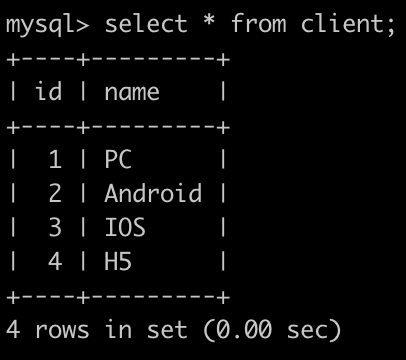
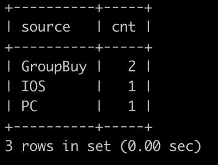

# [SQL83：牛客的课程订单分析(七)](https://www.nowcoder.com/practice/c5736983c322483e9f269dd23bdf2f6f?tpId=82&rp=1&ru=%2Fta%2Fsql&qru=%2Fta%2Fsql%2Fquestion-ranking)

## 1、题目

有很多同学在牛客购买课程来学习，购买会产生订单存到数据库里。

有一个订单信息表(order_info)，简况如下:



第1行表示user_id为557336的用户在2025-10-10的时候使用了client_id为1的客户端下了C++课程的非拼团(is_group_buy为No)订单，但是状态为没有购买成功。

第2行表示user_id为230173543的用户在2025-10-12的时候使用了client_id为2的客户端下了Python课程的非拼团(is_group_buy为No)订单，状态为购买成功。

。。。

最后1行表示user_id为557336的用户在2025-10-25的时候使用了下了C++课程的拼团(is_group_buy为Yes)订单，拼团不统计客户端，所以client_id所以为0，状态为购买成功。
 

有一个客户端表(client)，简况如下:



请你写出一个sql语句查询在2025-10-15以后，同一个用户下单2个以及2个以上状态为购买成功的C++课程或Java课程或Python课程的来源信息，第一列是显示的是客户端名字，如果是拼团订单则显示GroupBuy，第二列显示这个客户端(或者是拼团订单)有多少订单，最后结果按照第一列(source)升序排序，以上例子查询结果如下:



解析:

id为4，6的订单满足以上条件，且因为4是通过IOS下单的非拼团订单，则记: IOS 1

，6是通过PC下单的非拼团订单，则记: PC 1;

id为5，7的订单满足以上条件，且因为5与7都是拼团订单，则记: GroupBuy 2;

最后按照source升序排序。

## 2、题解

```sql
-- 子查询 
select source,
    count(*) cnt
from (
    select o.id,o.user_id,o.product_name,
        o.status,o.client_id,o.date,o.is_group_buy,
        if(o.client_id=0,'GroupBuy',c.name) source
    from (
        select * 
        from order_info
        where datediff(date,'2025-10-15')>0
            and status='completed'
            and product_name in ('C++','Java','Python')
       ) o left join client c on o.client_id=c.id
) t 
where user_id in (
    select user_id
    from order_info
    where datediff(date,'2025-10-15')>0
        and status='completed'
        and product_name in ('C++','Java','Python')
    group by user_id
    having count(*)>=2
    )
group by source
order by source;


-- --------------------------------------
-- 窗口函数
select r.client_name as source, count(r.id)
from(
    select t.id, t.is_group_buy,
    (case when t.is_group_buy="No" then c.name else 'GroupBuy' end) as client_name
    from (
        select *,
        count(*) over(partition by user_id) as cnt_course
        from order_info
        where date>=2025-10-15 
            and status='completed'
            and product_name in ('C++','Python','Java')
    )as t
    left join client c on c.id=t.client_id
    where t.cnt_course>=2
    order by t.id
) as r
group by r.client_name 
order by source

```

## 3、涉及内容


