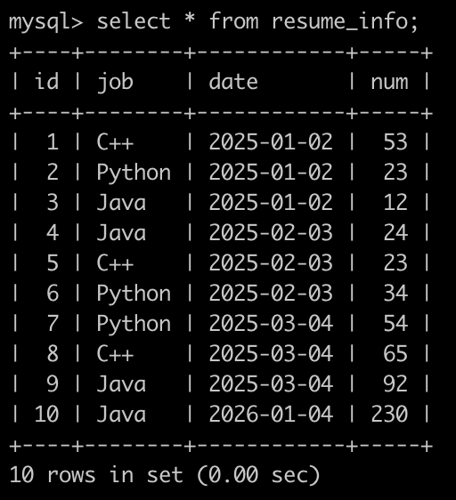
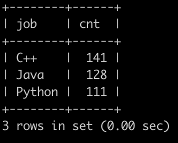

# [SQL84：实习广场投递简历分析(一)](https://www.nowcoder.com/practice/f5fc21a0630b4ca6a25ea3a48054ef47?tpId=82&rp=1&ru=%2Fta%2Fsql&qru=%2Fta%2Fsql%2Fquestion-ranking)

## 1、题目

在牛客实习广场有很多公司开放职位给同学们投递，同学投递完就会把简历信息存到数据库里。

现在有简历信息表(resume_info)，部分信息简况如下:



第1行表示，在2025年1月2号，C++岗位收到了53封简历

。。。

最后1行表示，在2026年1月4号，Java岗位收到了230封简历

请你写出SQL语句查询在2025年内投递简历的岗位和数量，并且按数量降序排序，以上例子查询结果如下:



## 2、题解

```sql
select job,
   sum(num) cnt
from resume_info
where YEAR(date)='2025'
group by job
order by cnt desc;

```

## 3、涉及内容


