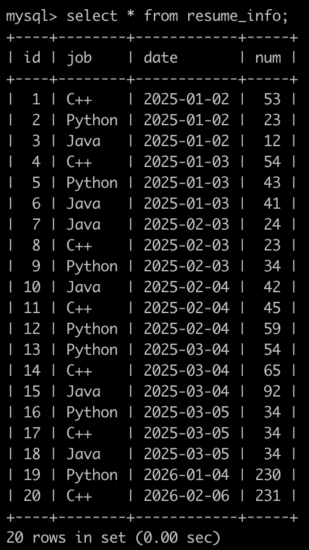
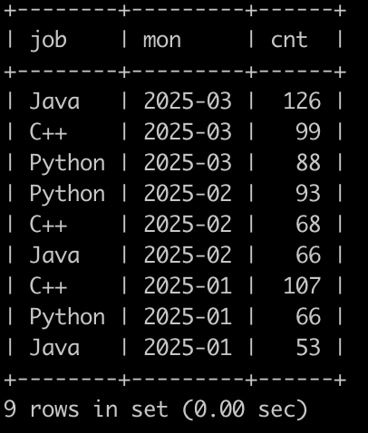

# [SQL85：实习广场投递简历分析(二)](https://www.nowcoder.com/practice/d323a4c97d1945e0aabe94e4d0bbb25d?tpId=82&&tqId=37923&rp=1&ru=/ta/sql&qru=/ta/sql/question-ranking)

## 1、题目

在牛客实习广场有很多公司开放职位给同学们投递，同学投递完就会把简历信息存到数据库里。

现在有简历信息表(resume_info)，部分信息简况如下:



第1行表示，在2025年1月2号，C++岗位收到了53封简历

。。。

最后1行表示，在2026年2月6号，C++岗位收到了231封简历

请你写出SQL语句查询在2025年内投递简历的每个岗位，每一个月内收到简历的数量，并且按先按月份降序排序，再按简历数目降序排序，以上例子查询结果如下:



## 2、题解

```sql
select job,
   date_format(date,'%Y-%m') mon,
   sum(num) cnt
from resume_info
where YEAR(date)='2025'
group by job,date_format(date,'%Y-%m')
order by mon desc,cnt desc;
-- 也可以用substr : substr(date,1,7) as mon
```

## 3、涉及内容


