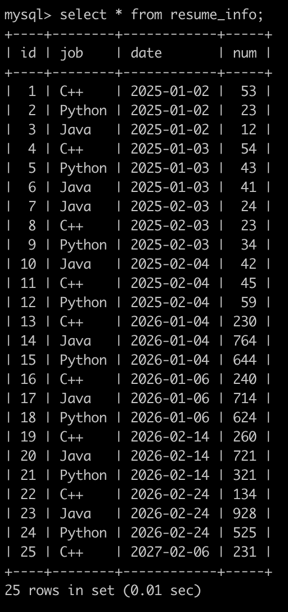
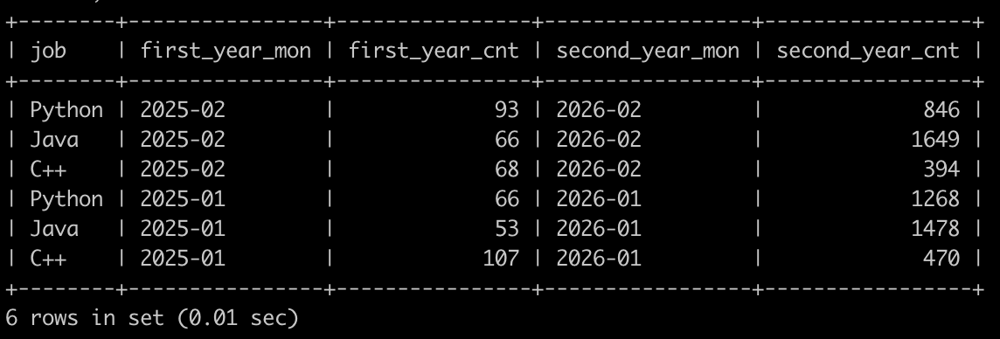

# [SQL86：实习广场投递简历分析(三)](https://www.nowcoder.com/practice/d323a4c97d1945e0aabe94e4d0bbb25d?tpId=82&&tqId=37923&rp=1&ru=/ta/sql&qru=/ta/sql/question-ranking)

## 1、题目

在牛客实习广场有很多公司开放职位给同学们投递，同学投递完就会把简历信息存到数据库里。

现在有简历信息表(resume_info)，部分信息简况如下:



第1行表示，在2025年1月2号，C++岗位收到了53封简历

。。。

最后1行表示，在2027年2月6号，C++岗位收到了231封简历

请你写出SQL语句查询在2025年投递简历的每个岗位，每一个月内收到简历的数目，和对应的2026年的同一个月同岗位，收到简历的数目，最后的结果先按first_year_mon月份降序，再按job降序排序显示，以上例子查询结果如下:



## 2、题解

```sql
select t1.job,t1.first_year_mon,t1.first_year_cnt,
    t2.second_year_mon,t2.second_year_cnt
from (
    select job,
       date_format(date,'%Y-%m') first_year_mon,
       sum(num) first_year_cnt
    from resume_info
    where YEAR(date)='2025'
    group by job,date_format(date,'%Y-%m')
) t1 
join
(select job,
       date_format(date,'%Y-%m') second_year_mon,
       sum(num) second_year_cnt
    from resume_info
    where YEAR(date)='2026'
    group by job,date_format(date,'%Y-%m')
) t2  on t1.job=t2.job and substr(t1.first_year_mon,6,2) = substr(t2.second_year_mon,6,2)
order by first_year_mon desc,job desc;
```

## 3、涉及内容


